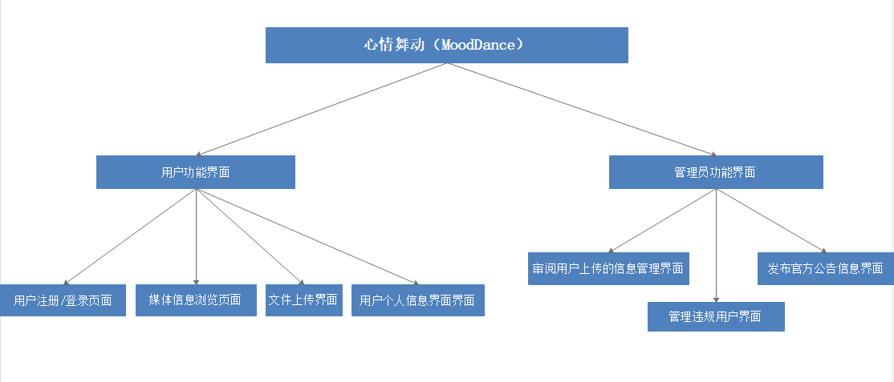
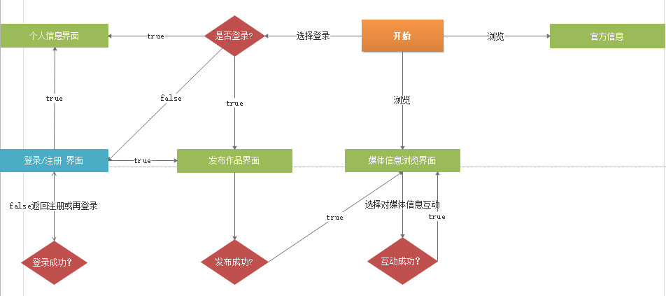
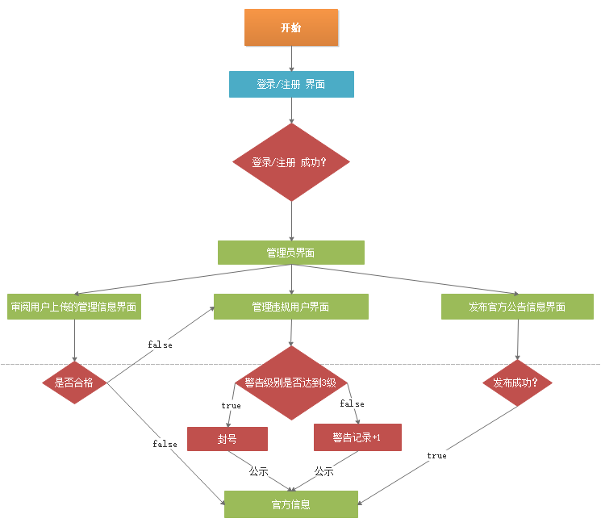

# MoodUpload
>网站项目名为情绪上载，你可以在这里分享你的生活心情或者浏览别人的生活心情。

## 一、项目技术分析

### 1.1客户端
-	浏览器：谷歌浏览器（Chrome/83.0.4103.97）。
-	分辨率：最佳效果1920 * 1080像素。

### 1.2采用技术
-	PHP：用在前后端交互，用php写的Json接口和连接服务器
-	Jquery：用在了Ajax的传值，用的$.get()和$.post()方法，还有$.getJson()
-	CSS3：用在页面的美化，菜单的3D效果，动画特效
-	Highcharts.js (v5.16.0)：用于个人简介的数据分析

## 二、需求分析
使用过Facebook后，发现Facebook在用户互动功能上比抖音好，但是Facebook不具备优秀的短视频操作流畅顺滑的感觉，抖音却没有在电脑端的视频应用，Facebook却可以适应电脑端的页面布局，在衡量这两种软件的优缺点后，我决定使用本学期学到的前端和php知识结合Facebook和抖音的优点做一个能适应pc到移动端的简洁地短视频娱乐网站——情绪上载（MoodUpload）

## 三、系统设计
### 3.1功能设计
根据需求分析的描述以及与用户的沟通，现制定网站实现目标如下：
#### 1、管理员功能部分
管理员负责对官方公告、用户视频、用户评论、用户账号使用权进行全面管理，其功能包括：
1）官方公告。能够完成添加、删除和修改官方公告信息。
2）用户视频。能够完成添加、删除和修改用户视频。
3）用户评论。能够完成添加、删除和修改用户的不良评论。
4）用户账号。在用户出现违规操作警告无效后，能够完成添加、删除和修改用户账号。
5）修改密码。管理员和用户都可以修改自己的登录密码。
6）退出系统。管理员、用户使用完后，执行退出功能，以清除相关数据。

#### 2、管理员功能部分：
-	发布官方公告（优秀用户，公告，广告）
-	审核用户视频
-	删除用户评论
-	删除用户账号
-	修改管理员的信息（账号-密码）

#### 3、用户功能部分：
-	发布视频作品
-	修改个人信息（头像，账号名，年龄，性别，地址，爱好，简介，密码）
-	删除添加评论

### 3.2系统功能结构图及说明
不分前后台功能结构图如下：

### 3.3系统操作流程图及流程描述
- 用户的系统流程图

- 管理员的系统流程图

