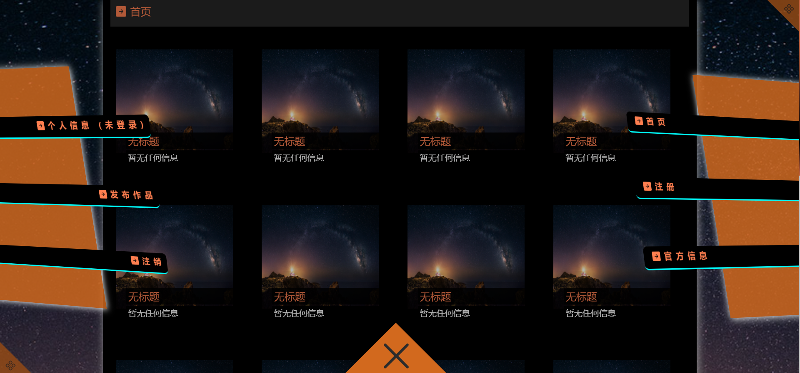

# MoodUpload
>网站项目名为情绪上载，你可以在这里分享你的生活心情或者浏览别人的生活心情。



>功能及结构详细说明请访问MoodUpload百科：https://github.com/ASWLaunchs/MoodUpload/wiki/%E9%A1%B9%E7%9B%AE%E6%96%87%E6%A1%A3

# 安装及使用说明：
<br>
1.下载项目文件到你的计算机上<br>
2.打开wampserver软件或者apache服务+mysql服务<br>
3.创建名为moodupload的数据库并导入<span style="color=red"> /sql/moodupload.sql </span>数据文件完成网站初始数据导入（想自定义数据库名可在``` /php/conn_PDO.php ```文件中进行修改即可）<br>
4.运行MoodUpload项目下的index.html文件即可正常访问网站首页<br>
<br>

------

普通用户：6@qq.com 密码为：000000 <br/>
系统管理员用户名为：admin 密码为：admin

------
<br>
目前是初代版本,数据库文件在完善中，初代版本并不能正常投入使用，正在迭代第二代完成云相册功能，如果出现问题可以在Issues区提出，我有时间将会为你解决，二代完成更新后将结束维护工作且不再提供技术支持
